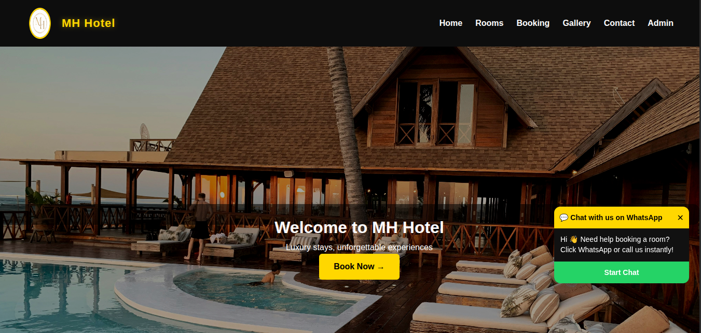
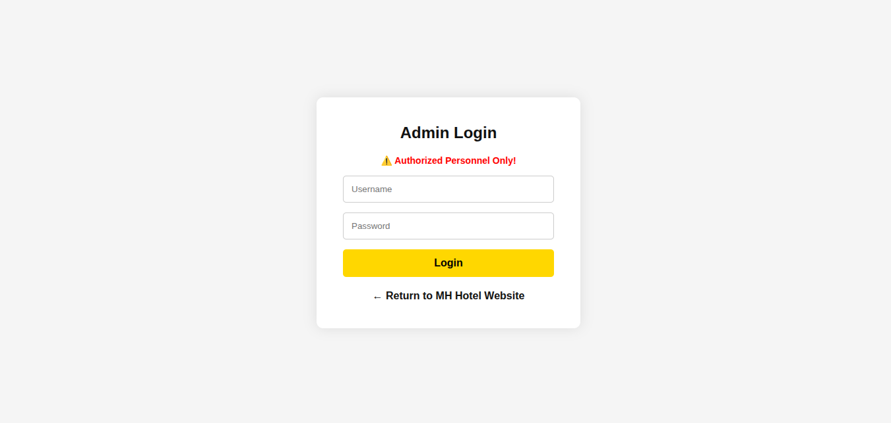
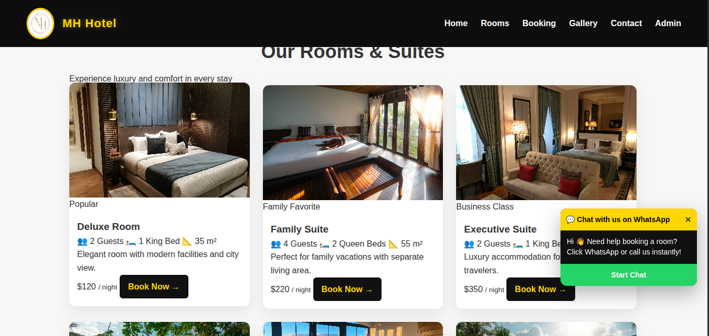

# 🏨 MH Hotel - Modern Hotel Management System

## 🌐 Live Demo
**[View Live Website](http://michaelphotofolio.atwebpages.com/modernhotel/)**

> Click the link above to see the live version of MH Hotel website!

---

## 📸 Website Screenshots

  
### 🏠 Homepage

  

### 🔐 Admin Login

  

### 🏡 Rooms & Suites

---

## 📋 About This Project

MH Hotel is a modern, fully functional hotel management website built with PHP, MySQL, HTML, CSS, and JavaScript. It provides a seamless experience for guests to browse rooms, make bookings, and contact the hotel.

### ✨ Key Features:

#### 🏨 Guest Features
- **Room Listings** - Browse available rooms with prices, descriptions, and images
- **Online Booking** - Real-time room reservation system with date selection
- **Room Search** - Filter rooms by type, price, and availability
- **Contact Forms** - Guest inquiry and messaging system
- **Image Gallery** - Showcase hotel amenities and rooms
- **About Page** - Hotel information and mission
- **Responsive Design** - Works perfectly on all devices

#### 🔐 Admin Features
- **Secure Login** - Admin authentication system
- **Dashboard** - Overview of rooms, bookings, and messages
- **Room Management** - View and manage all hotel rooms
- **Booking Management** - View and manage all reservations
- **Message Management** - Read and respond to guest inquiries
- **Booking Reports** - View booking details and revenue

#### 💡 Technical Features
- **Secure Authentication** - Password-protected admin panel
- **Session Management** - Secure session handling
- **SQL Injection Prevention** - Prepared statements for database queries
- **XSS Prevention** - Input sanitization and validation
- **Mobile Responsive** - Fully responsive design
- **Fast Loading** - Optimized images and code

---

## 🛠️ Technologies Used

### Backend
| Technology | Purpose |
|------------|---------|
| PHP 7.4+ | Server-side scripting |
| MySQL 5.7+ | Database management |
| MySQLi | Database connection |

### Frontend
| Technology | Purpose |
|------------|---------|
| HTML5 | Markup language |
| CSS3 | Styling and animations |
| JavaScript (ES6) | Interactive elements |
| Font Awesome | Icons |
| Google Fonts | Typography |

### Tools
| Tool | Purpose |
|------|---------|
| XAMPP/WAMP | Local development environment |
| Git & GitHub | Version control |
| AwardSpace | Web hosting |

---

## 📁 Project Structure
